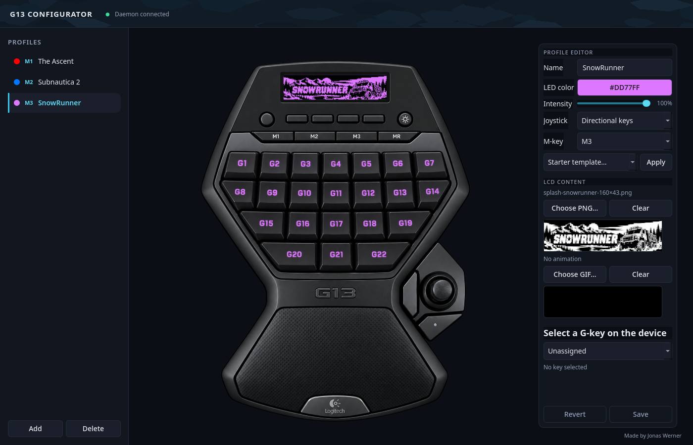
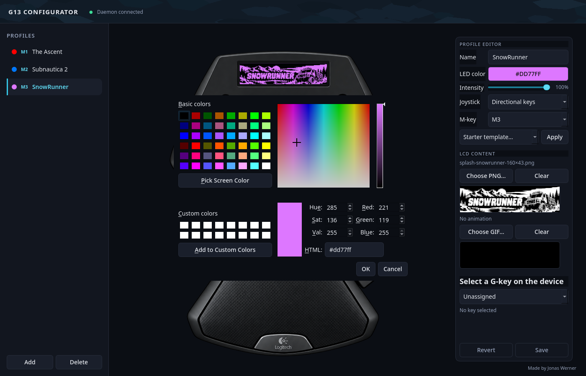

# G13 Configurator for Linux

G13 Configurator is an unofficial Linux driver and configuration application
for the Logitech G13 Advanced Gameboard (`046d:c21c`).

It provides:

- Per-profile key, shortcut, mouse-button, and macro assignments
- M1–M3 profile slots plus additional unassigned profiles
- Joystick direction, joystick-click, and side-button mappings
- Optional joystick mouse-pointer mode
- Per-profile RGB backlight color and intensity
- Profile splash images and animated GIFs on the 160×43 LCD
- Clock and system-stat LCD views
- A live view of the gameboard in the configuration application
- Automatic daemon startup through a systemd user service

This project is community software and is not affiliated with or endorsed by
Logitech.



## Download

Download the
[latest source archive](https://github.com/jonas-werner/g13-configurator/archive/refs/heads/main.zip),
extract it, and open a terminal in the extracted folder. You can also visit the
[GitHub repository](https://github.com/jonas-werner/g13-configurator) and choose
**Code → Download ZIP**.

Git users can clone it instead:

```bash
git clone https://github.com/jonas-werner/g13-configurator.git
cd g13-configurator
```

Keep the project folder after installation. The installed user service points
to the virtual environment inside this folder.

## Requirements

- A Logitech G13
- Linux with systemd and udev
- Python 3.11 or newer
- A desktop session for the graphical configurator
- `sudo` access during initial udev-rule installation

On Debian or Ubuntu, install the common prerequisites with:

```bash
sudo apt update
sudo apt install python3 python3-venv python3-pip python3-dev build-essential libusb-1.0-0
```

Other distributions need the equivalent Python, virtual-environment, compiler,
and libusb packages.

## Install

From the project folder:

```bash
python3 -m venv .venv
.venv/bin/python -m pip install --upgrade pip
.venv/bin/pip install -e .
./install.sh
```

The final command:

1. Installs a udev rule so the G13 can be used without running the driver as
   root.
2. Installs and starts `g13d` as a systemd user service.

Unplug and reconnect the G13 if it was connected during installation.

Check that the driver is running:

```bash
systemctl --user status g13d.service
```

## Start the configurator

Run:

```bash
.venv/bin/g13-gui
```

The daemon starts automatically when you log in. The configurator itself opens
only when you run the command above.

## Using profiles

The profile list is on the left. M1-, M2-, and M3-assigned profiles stay at the
top, followed by any unassigned profiles.

- Select a profile to activate and edit it.
- Use **Add** to create another profile.
- Use **Delete** to remove the selected profile after confirmation.
- Use **M-key** in the profile editor to assign or unassign M1, M2, or M3.
- Press the physical M1–M3 keys to activate the corresponding assigned profile.
- Choose a profile name, backlight color, and backlight intensity.
- Press **Save** to apply and persist changes.



At least one profile is retained, but every profile may be unassigned from the
physical M keys.

Profiles are stored as TOML files in:

```text
~/.config/g13-linux/profiles/
```

Back up this directory if you want to preserve your configuration.

## Assigning controls

Select a G-key or joystick control on the gameboard image, then choose an
assignment type:

- **Unassigned** — the control emits nothing.
- **Single keystroke** — one keyboard key.
- **Shortcut** — a chord such as `Ctrl+E` or `Shift+E`.
- **Macro sequence** — timed key presses and releases.
- **Mouse button** — left, right, middle, back, or forward click.

The assignable joystick controls are:

- Up, down, left, and right
- Joystick push button
- The two buttons beside the joystick

Set **Joystick** to **Mouse pointer** if you want the analog stick to move the
pointer instead of emitting the configured direction keys.

## Starter templates

The **Starter template** menu provides initial mappings for several games.
Applying one replaces the draft name, color, key bindings, and macros. Review
the result and press **Save** when satisfied.

Templates are starting points rather than official control schemes. In-game
bindings may differ from their defaults.

## LCD images and animations

Each profile can reference:

- One static PNG splash image
- One animated GIF

Both must be exactly **160×43 pixels**. The splash appears when a profile is
activated, after which its GIF can play.

The files in `assets/game-art/` are optional examples. You may edit, replace, or
remove them. Profiles can select compatible files from any location.

The buttons below the physical LCD select:

- **L1** — profile splash
- **L2** — profile GIF
- **L3** — clock, weekday, and date
- **L4** — CPU, memory, GPU/VRAM, temperatures, and network activity

The round application button at the upper left cycles through the available LCD
views. GPU values display `--` when the installed driver does not expose the
required metrics.

## Troubleshooting

### The configurator says “Daemon offline”

Check the service:

```bash
systemctl --user status g13d.service
journalctl --user -u g13d.service --since today
```

Restart it if necessary:

```bash
systemctl --user restart g13d.service
```

### The G13 is not detected

Confirm that USB sees it:

```bash
lsusb | grep -i '046d:c21c'
```

Then reinstall the udev rule and reconnect the device:

```bash
./install.sh
```

On systems without an active desktop login, ensure your user belongs to the
`plugdev` group or provide an equivalent device-access rule.

### Key presses do not reach applications

Confirm that the `uinput` kernel module is available:

```bash
sudo modprobe uinput
systemctl --user restart g13d.service
```

Some games launched through containers or compatibility layers may require
their input permissions to be configured separately.

### A selected image no longer loads

Profiles store the selected media path. Restore the file at its original
location or choose it again in the profile editor.

## Update

For a Git checkout:

```bash
git pull
.venv/bin/pip install -e .
systemctl --user restart g13d.service
```

Run `./install.sh` again if the systemd or udev files changed.

## Remove

Stop and remove the user service:

```bash
systemctl --user disable --now g13d.service
rm -f ~/.config/systemd/user/g13d.service
systemctl --user daemon-reload
```

Remove the udev rule:

```bash
sudo rm -f /etc/udev/rules.d/99-g13.rules
sudo udevadm control --reload-rules
```

You can then delete the project folder. User profiles remain in
`~/.config/g13-linux/profiles/` unless you remove them separately.

---

## Developer guide

### Architecture

The project is split into a privileged-access setup step and two unprivileged
Python processes:

- `g13d` owns the physical USB device, decodes input reports, sends virtual
  input events through evdev/uinput, updates the backlight and LCD, and stores
  profiles.
- `g13-gui` edits profiles and renders live device state.
- A newline-delimited JSON protocol over
  `$XDG_RUNTIME_DIR/g13d.sock` connects clients to the daemon.
- The udev rule grants the logged-in user access to the G13. The daemon itself
  does not run as root.

Important modules:

- `g13/hardware/device.py` — USB discovery and device access
- `g13/hardware/report.py` — raw input-report decoding
- `g13/hardware/lcd.py` — LCD packing, RGB backlight, and mode LEDs
- `g13/daemon/service.py` — input, macros, profiles, LCD views, and socket API
- `g13/profile.py` — profile validation, migration, and atomic TOML writes
- `g13/gui/main.py` — main window, daemon client, and live state listener
- `g13/gui/binding_editor.py` — profile and assignment editor
- `g13/gui/keyboard_view.py` — scaled gameboard rendering and hit testing
- `g13/gui/device_layout.py` — measured overlay geometry
- `g13/system_stats.py` — dependency-free Linux statistics and LCD renderers

The required gameboard artwork is packaged at
`g13/gui/assets/g13-stylized-transparent.png`. Optional, user-editable LCD
artwork belongs under `assets/game-art/` or outside the repository.

### Hardware behavior

The driver communicates with USB device `046d:c21c`.

- Input arrives as USB HID reports and is translated into named G13 controls.
- Keyboard and mouse output is emitted by a virtual uinput device.
- The RGB backlight uses HID feature report `0x0307`.
- Backlight intensity is implemented by scaling each RGB channel from 0–100%.
- M1/M2/M3/MR indicator LEDs use feature report `0x0305`.
- LCD frames are 160×43 monochrome images packed into six controller pages and
  written as a 992-byte interrupt payload.

Joystick direction handling uses hysteresis to prevent repeated transitions
near the analog thresholds. Mouse mode converts displacement from center into
continuous relative movement.

### Profile format

Profiles live in `~/.config/g13-linux/profiles/` and are loaded dynamically.
A simplified profile looks like:

```toml
slot = 1
name = "Example"
color = [0, 120, 255]
backlight_intensity = 70
stick_mode = "keys"
lcd_image = "/path/to/splash.png"
lcd_gif = "/path/to/animation.gif"

[bindings]
G4 = "KEY_W"
G10 = "KEY_A"
LEFT = "BTN_LEFT"
STICK_UP = "KEY_UP"

[macros]
G5 = [
  { code = "KEY_LEFTCTRL", down = true, delay_ms = 0 },
  { code = "KEY_E", down = true, delay_ms = 0 },
  { code = "KEY_E", down = false, delay_ms = 50 },
  { code = "KEY_LEFTCTRL", down = false, delay_ms = 0 },
]
```

Profile writes are validated and atomically replaced. M slots are optional and
unique; TOML uses `slot = 0` for an unassigned profile.

### Development setup

Create the same editable environment used by the normal installation:

```bash
python3 -m venv .venv
.venv/bin/pip install -e .
```

Run the complete test suite:

```bash
.venv/bin/python -W error::ResourceWarning -m unittest discover -s tests -v
```

Run the daemon in the foreground while developing:

```bash
systemctl --user stop g13d.service
.venv/bin/g13d
```

In another terminal:

```bash
.venv/bin/g13-gui
```

Stop the foreground daemon and restart the service when finished:

```bash
systemctl --user start g13d.service
```

For GUI work without a display, tests use Qt’s `offscreen` platform.

### Hardware diagnostics

The manual diagnostics are kept outside the installable package under `tools/`.
Stop the daemon before using them so that only one process owns the USB device:

```bash
systemctl --user stop g13d.service
.venv/bin/python tools/input_diagnostic.py
```

The input diagnostic prints decoded keys and joystick values. To push a test
LCD frame and cycle the backlight colors instead, run:

```bash
.venv/bin/python tools/lcd_diagnostic.py
```

Restart the normal service afterwards:

```bash
systemctl --user start g13d.service
```

### Extending the project

- Add game templates in `g13/presets.py`.
- Add profile fields in `g13/profile.py`, including validation, serialization,
  migration defaults, GUI handling, and round-trip tests.
- Add daemon commands in `g13/daemon/service.py` and document them in
  `g13/daemon/protocol.py`.
- Keep USB writes serialized through the daemon’s device lock.
- Keep macros balanced: every emitted key-down event must eventually have a
  matching key-up event, including cancellation paths.
- Keep LCD renderers at 160×43 and convert final frames to monochrome.
- Update `g13/gui/device_layout.py` rather than scattering image coordinates
  through paint or mouse-event code.

Before submitting changes, run the full tests and check that the daemon still
starts cleanly with the physical G13 connected.

## License

G13 Configurator is available under the [MIT License](LICENSE).
